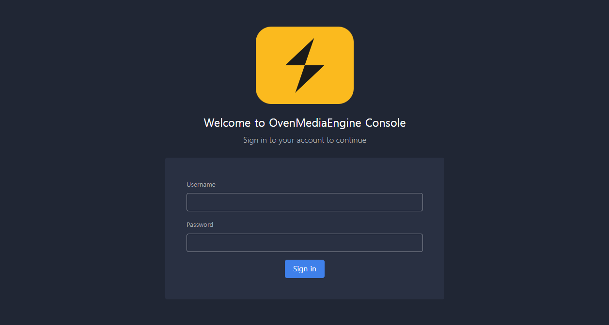
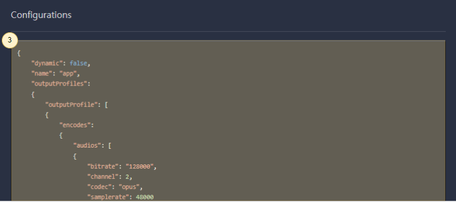
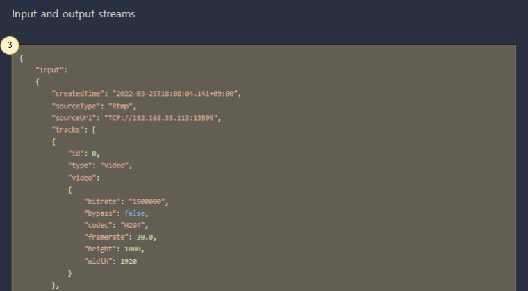
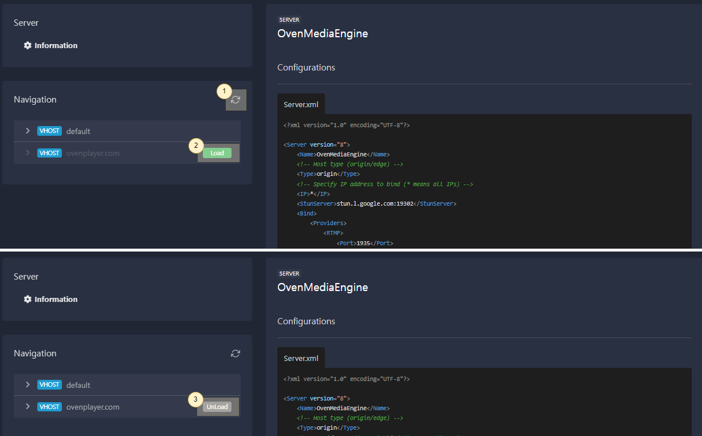
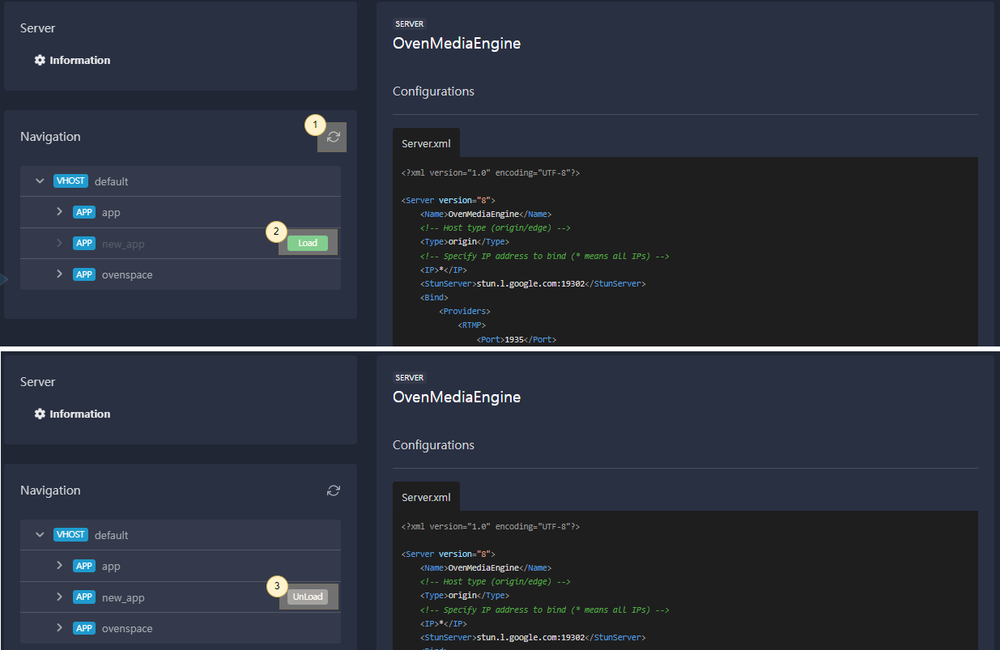
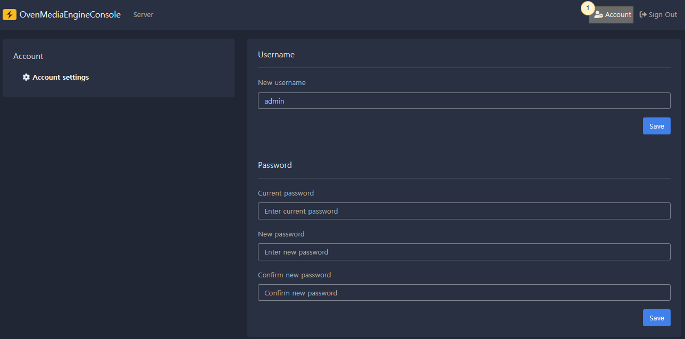

# Web Console

## Overview

The main features of Web Console are:

* Read and display the config file of OvenMediaEngine.
* Interpret the OvenMediaEngine configuration file and work with the REST API.
* Use the REST API to display a list of Virtual Hosts, Applications, Streams, and configuration information.
* You can reload Virtual Host and Application.
* You can load and unload Virtual Hosts that have been added or removed from the OvenMediaEngine configuration file.
* Provide a Test Player that can play on the generated stream.

## Installation & Configuration

The Web Console is distributed as part of the OvenMediaEngine Enterprise package. The default installation path and running port for the Web Console are:

| Installation path       | `/usr/share/ovenmediaengine/console`                                   |
| ----------------------- | ---------------------------------------------------------------------- |
| Configuration file path | `/usr/share/ovenmediaengine/console/conf/config.yaml`                  |
| Log file path           | `/var/log/ovenmediaengine/console/ovenmediaengine-console.log`         |
| Running port            | `5000`                                                                 |
| Initial account         | <p>username: <code>admin</code></p><p>password: <code>admin</code></p> |

The default configuration for the Web Console is as follows:

```yaml
# Config about the OvenMediaEngine Console.
ovenmediaengineconsole:
  # Port for serve OvenMediaEngine Console. Default is 5000.
  port: 5000
  # Log dir of OvenMediaEngine Console.
  # When using a different value, be careful that the directory exists.
  logDir: /var/log/ovenmediaengine/console
  # Log level: CRITICAL, FATAL, ERROR, WARN, WARNING, INFO, DEBUG, NOTSET
  logLevel: DEBUG

# Config about the OvenMediaEngine.
ovenmediaengine:
  # Directory where the OvenMediaEngine binary is installed.
  # Default is /usr/share/ovenmediaengine.
  installedDir: /usr/share/ovenmediaengine
```

## Common User Interfaces

This section describes the common user interface of Web Console.

### Sign in

.png>)

You can sign in from this login screen. A Username and Password of the initial account are `admin`.

### Common Layout



#### ① Home Link (Server page)

This logo is a link to the first entry screen. You can check the settings of OvenMediaEngine.

#### ② Account Information Link

This tab is a link to a page where you can edit your account information.

#### ③ Sign Out

Sign out and then expire the session.

#### ④ Virtual Host, Application, Stream Navigation

Tree-structured navigation with access to Virtual Hosts, Applications, and Streams running on OvenMediaEngine. The selected resource is highlighted.


You can load and unload virtual hosts or applications when added or removed from the OvenMediaEngine configuration.


#### ⑤ Update Virtual Host, Application, Stream Navigation

Reload the Virtual Host, Application, and Stream information. If a new stream is added to your application, you can view the new stream.

#### ⑥ Current Path

Shows the path of the selected Virtual Host, Application, and Stream. You can click the parent path to choose that resource.

#### ⑦ Virtual Host, Application, Stream Details

Displays Statistics, Actions, and Setting information of the selected resource.

## Features

Describe the main features of Web Console.

### Display the Configuration

The OvenMediaEngine Console displays each Server, Virtual Host, Application, and Stream configuration.

#### Server Configuration

.png>)

**① Display Configuration Files**

If you select Server, you will see all the configuration files used by OvenMediaEngine.

#### Virtual Host, Application, Stream Statistics, and Information

If you select Virtual Host, Application, or Stream, you can see traffic/connection statistics and configuration.

.png>)





**① Statistics**

You can check the cumulative bytes in/out and the number of connected sessions for each protocol.

**② Creation Time**

You can check the creation time of the selected resource.

**③ Detailed Information**

Display detailed information about the selected resource. When Virtual Host or Application is selected, the configuration is displayed, and when Stream is selected, the input stream and output stream information is displayed.

### Reload Virtual Host or Application Dynamically

If you change the Virtual Host or Application settings directly in the Server.xml or include the Virtual Host configuration file, you can apply the changes to OvenMediaEngine without restarting OvenMediaEngine. Use the Actions → Reload button on the details page of Virtual Host or Application.

 .png>)

### Add or Remove Virtual Hosts Dynamically

Suppose you modify the OvenMediaEngine Server.xml directly to add a new Virtual Host or remove an existing Virtual Host. In that case, you can reflect the added or removed Virtual Host to the OvenMediaEngine without restarting the OvenMediaEngine. Likewise, if you add or delete the separated Virtual Host configuration files, it will work similarly.



**① Reload the OvenMediaEngine Configuration**

To reload the modified configuration file, refresh each page or use the `Refresh` button in the left navigation.

**② Add a new Virtual Host**

Suppose a new Virtual Host is added to the configuration file. In that case, the new Virtual Host will be added to the left navigation, and you will see a `Load` button that can be immediately reflected in the OvenMediaEngine.

**③ Remove the existing Virtual Host**

Similarly, if an existing Virtual Host is removed from the configuration file, you will see an `Unload` button in the left navigation. You can use the Unload button to remove a current Virtual Host from OvenMediaEngine.

### Add or Remove Applications Dynamically

As with Virtual Host, if you modify the OvenMediaEngine configuration file directly to add or remove an Application, you can add or remove the Application to OvenMediaEngine without restarting OvenMediaEngine.



**① Reload OvenMediaEngine Configuration**

To reread the modified configuration file, refresh each page or use the `Refresh` button in the left navigation.

**② Add a new Application**

When a new Application is added to the config file, the new Application is added to the left navigation with a Load button that can be immediately applied to the OvenMediaEngine. You can use the Load button to apply the new Application to OvenMediaEngine.

**③ Remove the existing Application**

Similarly, if an existing Application is removed from the configuration file, an `Unload` button will appear in the left navigation.

### Test Player

We provide a Test Player that can play that Stream.

.png>)

**① Test Playback Link**

If you select a Stream, you can find the section where you can play the stream with the `Test Playback` link.

**② OvenMediaEngine Host Settings**

Set the IP address or domain of OvenMediaEngine (<mark style="color:red;">required</mark>).


Host information is different depending on the operating environment of OvenMediaEngine, so enter it manually.


**③ TCP Playback Settings**

Check if you want to play the WebRTC stream with TCP.

**④ Output Stream List**

It interprets the information set in `②` and `③` and the configurations of OvenMediaEngine and display the list of playable output streams.

**⑤ Output Stream Playback**

If you click the `Play` button, the stream is played with `⑥` Test Player (OvenPlayer).

### Account Settings

You can change the account information to sign in to the Web Console.



**① Account Setting Link**

You can enter the account information page through the `Account` link.

The default account is set to username: `admin`, password: `admin`. If you change your account information, your session will be expired, and you will need to sign in again.
